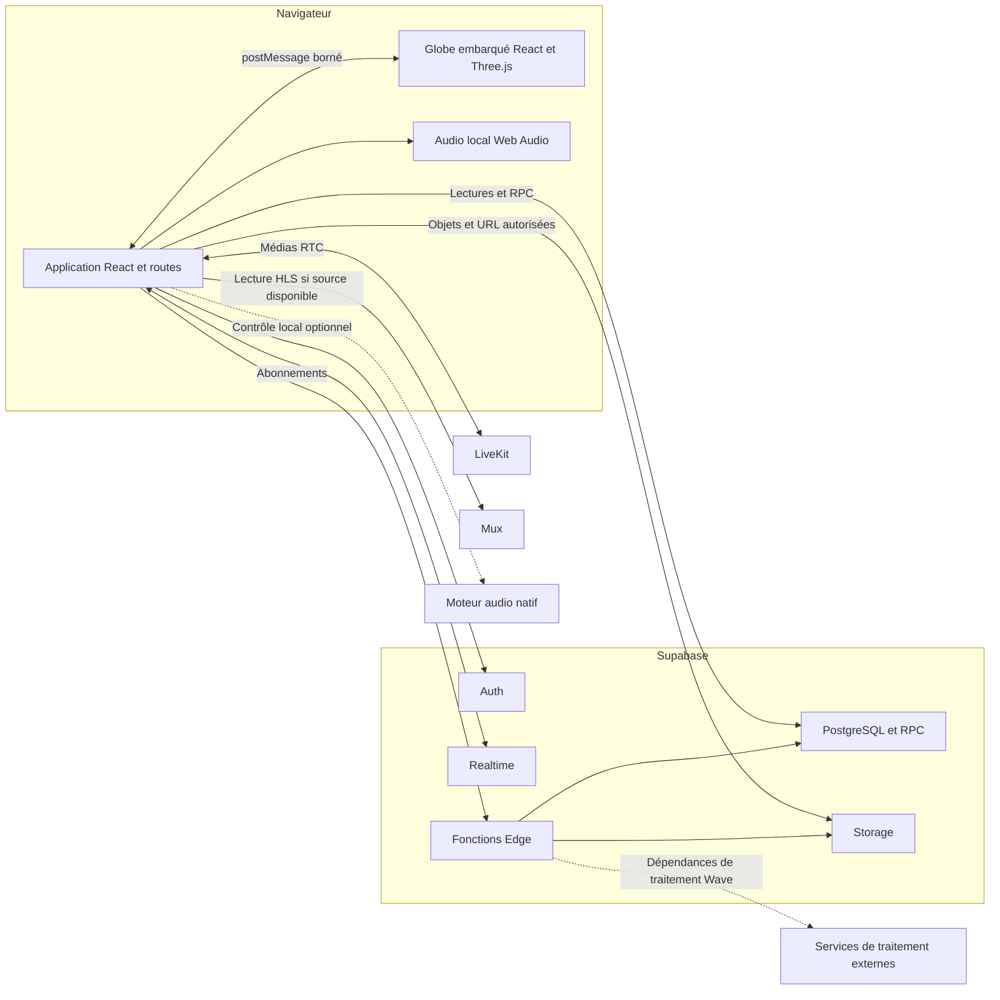
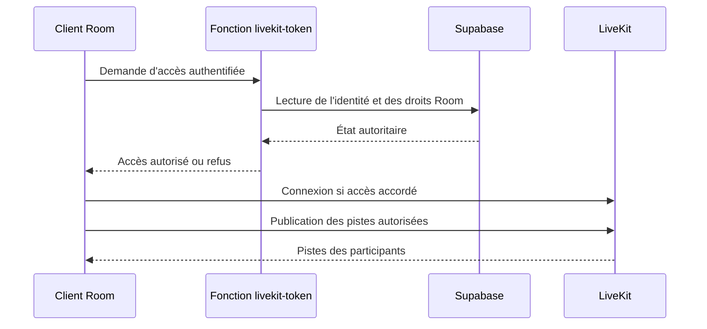

# Meewav — architecture du dépôt actuel

Cette cartographie décrit le code au commit `c771f379647cc24584d83b6edf39716928443743`, lu le 13 septembre 2026. Les sources citées rendent les affirmations traçables ; aucun test fonctionnel, accès à une base distante ou déploiement n'a été effectué pour cette rédaction.

**Présent dans le code**, **implémenté/raccordé**, **vérifié**, **déployé** et **prévu** sont des états distincts, définis dans l'[index](README.md). Pour les composants serveur décrits ici : **Présence dans le dépôt confirmée — état de déploiement à vérifier.**

## 1. Vue d'ensemble

L'application Web est une interface React à routage client. Ses services appellent Supabase ; les Rooms possèdent aussi un client LiveKit. Le globe est un document React/Three.js embarqué, préparé par le build Web. Un moteur audio natif C++ est développé séparément et dispose d'un raccordement de contrôle optionnel.

Les flèches représentent des chemins identifiables dans le code ; elles ne certifient pas la disponibilité des destinations. Le contrôle du moteur natif n'est pas une preuve de transport de son audio vers les Rooms. Les sources et limites de chaque liaison sont détaillées ci-dessous.

## 2. Frontend et organisation

[src/main.tsx](../src/main.tsx) monte React ; [src/App.tsx](../src/App.tsx) assemble `BrowserRouter`, le contexte d'authentification, les routes et des modules chargés à la demande. Il installe aussi le contexte des appels Rooms et, pour les parcours concernés, celui du moteur audio.

Les dépendances déclarées dans [package.json](../package.json) comprennent React, React Router, TypeScript, Vite, Supabase JS, Three.js, LiveKit, hls.js et openDAW. Le code mêle TypeScript et JavaScript ; il ne faut pas confondre la présence d'une dépendance avec son usage sur toutes les pages.

| Emplacement | Responsabilité attestée |
|---|---|
| [src/features/auth/](../src/features/auth/) | Session, parcours d'authentification, onboarding et modes d'aperçu. |
| [src/features/profile/](../src/features/profile/), [messaging/](../src/features/messaging/), [market/](../src/features/market/), [tremplin/](../src/features/tremplin/) | Interfaces, règles et services de ces espaces. |
| [src/features/rooms/](../src/features/rooms/) | Accueil, présentations des Rooms, participation, régie, audio et live. |
| [src/features/shorts/](../src/features/shorts/) et [src/features/scene/](../src/features/scene/) | L'espace actuel La Scène reste réparti entre ces deux dossiers : page principale, lecteur, catalogue, TV et contrats média. |
| [src/features/globe/](../src/features/globe/) | Intégration du globe et modules historiques encore présents ; l'entrée active est précisée plus bas. |
| [supabase/](../supabase/) | Migrations, fonctions Edge, configuration et contrats de tests SQL. |
| [apps/meewav-audio-engine/](../apps/meewav-audio-engine/) | Composant natif audio distinct du frontend. |

Les routes comprennent `/auth`, `/globe`, `/messages`, `/rooms/*`, `/scene/*`, `/market/*`, `/tremplin/*`, `/profile/*` et une vue visiteur `/profile/view/:profileId`. Des alias historiques subsistent. Leur routage est défini dans [App.tsx](../src/App.tsx), pas par les anciens guides de navigation.

## 3. Authentification et modes d'exécution

Le [client Supabase](../src/lib/supabaseClient.ts) est partagé par les services Web. [AuthPage.tsx](../src/pages/AuthPage.tsx) appelle les méthodes de connexion, d'inscription et OAuth de Supabase Auth. [AuthProvider.tsx](../src/features/auth/AuthProvider.tsx) récupère la session, écoute ses changements et consulte le profil privé par RPC. [auth.service.ts](../src/features/auth/auth.service.ts) porte notamment les appels d'onboarding et de mise à jour de la découverte publique.

[RequireAuth.tsx](../src/features/auth/RequireAuth.tsx) traite l'attente de session, l'absence d'authentification et l'onboarding incomplet. Cette garde d'interface ne remplace pas les autorisations serveur. La configuration effective des fournisseurs OAuth, des redirections et de Supabase Auth reste à vérifier sur l'environnement visé.

Des aperçus locaux peuvent suivre des chemins particuliers : [localAuthPreview.ts](../src/features/auth/localAuthPreview.ts), [App.tsx](../src/App.tsx) et [start-development.mjs](../scripts/start-development.mjs) les explicitent. Le retour vers `/auth` à chaque chargement de document via `VITE_AUTH_ENTRY_PREVIEW` est conditionné au développement dans [main.tsx](../src/main.tsx).

Le [Marketplace](../src/features/market/market.flags.ts) et la [Messagerie](../src/features/messaging/messaging.flags.ts) sélectionnent un mode `demo` ou `supabase`. Le mode de démonstration n'atteste donc pas la réussite des opérations sur un backend réel. Aucun mode actif distant n'est déduit des fichiers d'exemple ou de l'aperçu local.

## 4. Backend, données et autorisations

Le backend décrit par les sources repose sur Supabase : Auth, PostgreSQL, RPC, Realtime, Storage et fonctions Edge. Le navigateur appelle directement plusieurs de ces interfaces via des services TypeScript ; il n'existe pas, sur ces chemins, un serveur applicatif intermédiaire unique qui traiterait toutes les opérations.

| Domaine | Exemple de raccordement présent | Source |
|---|---|---|
| Profil | Lectures propriétaire/publiques et écritures via le repository du profil. | [profile.service.ts](../src/features/profile/profile.service.ts) |
| Messagerie | RPC de conversations, messages, invitations et réactions. | [messaging.service.ts](../src/features/messaging/messaging.service.ts) |
| Marketplace | RPC de catalogue, capacités et annonces. | [market.service.ts](../src/features/market/market.service.ts) |
| La Scène | Lecture de `published_media_files` et `public_profiles`, résolution des médias. | [sceneCatalog.service.ts](../src/features/scene/sceneCatalog.service.ts) |
| Rooms | Services métier et abonnements Realtime ; programme partagé par repository dédié. | [place.service.ts](../src/features/rooms/place/place.service.ts), [placeProgramLayout.repository.ts](../src/features/rooms/place/placeProgramLayout.repository.ts) |

[supabase/migrations/](../supabase/migrations/) contient **88 migrations SQL** à cette révision. Elles décrivent des évolutions de tables, fonctions et autorisations. Par exemple, la [migration du jury partagé](../supabase/migrations/20260908060000_rooms_shared_jury.sql) crée une table, active RLS et définit des politiques et fonctions ; la [migration des demandes Loge](../supabase/migrations/20260908001000_loge_viewer_requests_v1.sql) définit une commande métier serveur.

Ces fichiers ne donnent pas l'état de la base distante. Il faut réconcilier, par environnement, migrations réellement appliquées, fonctions disponibles, politiques et configuration Realtime. Les autres SQL et les migrations historiques conservées hors du dossier actif ne sont pas une invitation à tout appliquer. Les [tests SQL](../supabase/tests/database/) constituent des contrats présents, pas des résultats d'exécution actuels.

### Fonctions serveur

Les [fonctions Edge](../supabase/functions/) utilisent TypeScript et `Deno.serve`. Elles couvrent notamment :

- L'accès LiveKit aux Rooms et aux appels, ainsi que les workers de révocation.
- L'émission et la consommation de tickets d'appairage audio.
- Les URL de ressources Classe et d'avant-premières Loge.
- Les tickets d'envoi, confirmations, états de traitement, accès viewer et vérifications d'infrastructure Wave.

Exemples concrets : [livekit-token](../supabase/functions/livekit-token/index.ts), [appairage audio](../supabase/functions/rooms-audio-engine-pairing-ticket/index.ts), [ressources Classe](../supabase/functions/rooms-classe-resource-url/index.ts), [envoi Wave](../supabase/functions/rooms-wave-asset-upload-ticket/index.ts). Leurs contrôles d'accès et leurs dépendances doivent être examinés fonction par fonction ; aucune validation globale de sécurité n'est revendiquée ici.

## 5. Stockage, médias et traitement

Les métadonnées et les objets sont traités séparément. Le [service média du profil](../src/features/profile/profile.media.service.ts) accède à `media_files` et à Storage ; les services [Marketplace](../src/features/market/market.service.ts) et [catalogue Scène](../src/features/scene/sceneCatalog.service.ts) résolvent aussi des URL de médias. Certains accès utilisent des URL signées. Des ressources de démonstration sont parallèlement livrées dans [public/](../public/).

Le chemin Wave est plus spécialisé : le [repository d'infrastructure](../src/features/rooms/wave-infra/supabaseWaveInfra.ts) appelle les fonctions de ticket, confirmation et état. La [fonction de ticket](../supabase/functions/rooms-wave-asset-upload-ticket/index.ts) contrôle la demande, appelle l'autorité SQL et prépare un envoi vers un bucket privé. Elle refuse notamment l'opération si la dépendance de traitement n'est pas configurée. La [confirmation](../supabase/functions/rooms-wave-asset-upload-confirm/index.ts) et les [contrôles de santé](../supabase/functions/rooms-wave-infra-health/index.ts) matérialisent d'autres étapes du contrat.

Les services externes de traitement audio ne sont pas considérés comme disponibles parce qu'une URL peut être configurée. Leur implémentation livrée, leur déploiement, la consommation des files et la production des dérivés restent à attester.

La Scène possède un [coordinateur de session média](../src/features/scene/mediaSession/mediaSessionCoordinator.ts) qui arbitre un propriétaire de lecture. Des usages sont présents dans [ShortsVideoPlayer.tsx](../src/features/shorts/ShortsVideoPlayer.tsx) et [SceneTvSchedule.tsx](../src/features/scene/tv/SceneTvSchedule.tsx). Cela ne garantit pas que tous les lecteurs de l'application sont déjà raccordés à ce coordinateur.

## 6. Live et services externes

Le [service LiveKit](../src/features/rooms/place/placeLiveKit.service.ts) demande un accès à `livekit-token`, puis gère connexion, publications et pistes distantes. La [fonction serveur correspondante](../supabase/functions/livekit-token/index.ts) construit des droits selon le rôle et l'état de la Room. Le [repository de programme](../src/features/rooms/place/placeProgramLayout.repository.ts) synchronise les décisions de régie via Supabase ; ces décisions sont distinctes des pistes média transportées.

Ce schéma décrit le chemin prévu par l'implémentation, pas un essai réalisé pendant la rédaction. La disponibilité LiveKit, les autorisations entre comptes, la révocation, les périphériques et la qualité réseau restent à vérifier en conditions réelles.

| Service ou composant externe | Usage attesté dans le dépôt | Limite de preuve |
|---|---|---|
| Supabase | Auth, données/RPC, Realtime, Storage et fonctions Edge. | État du projet distant et des déploiements à vérifier. |
| LiveKit | Client RTC, contrôle d'accès serveur, publication/réception et révocation. | Service disponible et parcours multi-utilisateurs non attestés par cette lecture. |
| Mux | Le [service Rooms](../src/features/rooms/place/place.service.ts) construit une URL HLS depuis un identifiant de lecture ; une [migration broadcast](../supabase/migrations/20260603123000_rooms_mux_broadcast.sql) existe. | Ne prouve pas une chaîne complète d'ingestion, d'Egress, de transcodage ou d'enregistrement opérationnelle. |
| hls.js | Chargement dans [placeStageLayoutTile.tsx](../src/features/rooms/place/placeStageLayoutTile.tsx) pour les sources HLS. | Bibliothèque de lecture, pas service de diffusion. |
| Traitement audio Wave | Contrats et configuration attendue dans les fonctions Edge. | Implémentation et exploitation des services de traitement à vérifier. |
| openDAW/WASM | Dépendances et ressources de laboratoire chargées selon le mode de build. | Présence de traitement expérimental, pas certification de qualité ni disponibilité générale. |

**Présence dans le dépôt confirmée — état de déploiement à vérifier.** Aucune chaîne automatique LiveKit → Mux n'est affirmée à partir du seul schéma de données.

## 7. Audio navigateur et composant natif

[placeLocalAudioEngine.ts](../src/features/rooms/place/placeLocalAudioEngine.ts) définit le traitement local, les entrées/sorties, le monitoring et l'interface des adaptateurs de correction. [usePlaceLocalAudio.ts](../src/features/rooms/place/usePlaceLocalAudio.ts) expose ce moteur aux parcours concernés. Les ressources openDAW/WASM et le moniteur natif de laboratoire sont ajoutés conditionnellement par [vite.config.js](../vite.config.js). Un traitement audible localement ne prouve pas sa réception par un autre participant.

[apps/meewav-audio-engine/CMakeLists.txt](../apps/meewav-audio-engine/CMakeLists.txt) décrit un composant **C++20/CMake** avec moteur, scanner et options de POC. Les backends JUCE et VST3 sont désactivés par défaut. Le chemin JUCE refuse explicitement la construction de son adaptateur non implémenté ; sa présence comme option ne signifie donc pas qu'il est utilisable.

Le [provider Web](../src/features/rooms/audio-engine/AudioEngineProvider.tsx), le [service d'appairage](../src/features/rooms/audio-engine/audioEngine.pairing.ts) et le [transport Windows](../apps/meewav-audio-engine/src/bridge/windows/WindowsLoopbackHttpTransport.cpp) matérialisent le contrôle local authentifié. Le contrat générique [AudioBridge.h](../apps/meewav-audio-engine/src/bridge/AudioBridge.h) contient encore une implémentation indisponible du pont audio natif vers les Rooms. Le contrôle, le traitement natif et le transport audio doivent rester trois capacités distinctes dans la documentation.

Les motifs des choix et contraintes éditeurs sont conservés dans le [registre de préservation](archive/2026-09-13/informations-a-preserver.md). Ils ne constituent ni des licences accordées ni une preuve de distribution opérationnelle du moteur.

## 8. Globe actif et composants historiques

Le chemin actif est [MonGlobe.tsx](../src/features/globe/MonGlobe.tsx) → [VinylGlobe.tsx](../src/features/globe/VinylGlobe.tsx) → document `/globe-vinyle/index.html`. Le renderer et ses ressources sont dans [vendor/globe-vinyle/](../vendor/globe-vinyle/), avec leurs propres dépendances React/Three.js.

[scripts/vinyl-globe.mjs](../scripts/vinyl-globe.mjs), enregistré dans Vite, sert les sources en développement et prépare le document, ses bundles et ses ressources pour le build. L'iframe isole le renderer et ses styles ; la navigation passe par un `postMessage` dont l'origine, la fenêtre émettrice et les destinations sont contrôlées dans `VinylGlobe.tsx`. La justification de cet isolement est également conservée dans le [registre historique](archive/2026-09-13/informations-a-preserver.md).

La géographie d'inscription lit les données du globe via [vinylGlobeGeography.ts](../src/features/auth/vinylGlobeGeography.ts). Les sources et transformations restent documentées dans les [notices de provenance](../vendor/globe-vinyle/data/SOURCES.md), sans reprendre leurs comptages historiques comme inventaire actuel.

MapLibre, PMTiles, l'outillage géographique et le [serveur MVT Express](../server/mvt-tile-server/index.js) restent présents dans le dépôt. Ils ne sont pas le renderer monté par cette route. [start-development.mjs](../scripts/start-development.mjs) réserve le serveur MVT à l'option `--legacy-globe-tiles` ; il n'est pas un prérequis implicite de l'architecture active.

## 9. Frontières établies et points à vérifier

Décision produit confirmée pour ce socle : **les UX Marketplace et Tremplin sont implémentées ; leur non-activation au lancement national est un choix de roadmap, avec Marketplace en phase 2 et Tremplin en phase 3.** Cet ordre d'activation n'est pas déduit des flags techniques. Les limites transactionnelles ci-dessous décrivent les raccordements actuels, sans remettre en cause l'implémentation des parcours UX.

| Sujet | Ce que le code permet d'affirmer | Ce qui ne doit pas être affirmé |
|---|---|---|
| Tremplin | [UX implémentée](../src/features/tremplin/TremplinPage.tsx) ; [apiTransactions est désactivé](../src/features/tremplin/tremplinFeatureFlags.ts) et les [quotes](../src/features/tremplin/tremplinTokenData.ts) incluent des données de démonstration. | Une API financière opérationnelle ou des transactions réelles disponibles. |
| Marketplace | [UX implémentée](../src/features/market/MarketPage.tsx) ; le parcours connecté désactive le paiement et le [panier](../src/features/market/MarketCartPanel.tsx) distingue ce comportement. | Un paiement, un séquestre ou un payout en production. |
| Auth, profils, messagerie, Rooms | Des services et des appels concrets existent. | Leur disponibilité distante ou une recette exhaustive entre comptes réels. |
| Migrations et fonctions | Sources exécutables présentes et versionnées. | Application de toutes les migrations ou déploiement de toutes les fonctions. |
| Build et livraison | Scripts Vite et préparation du globe présents dans le dépôt. | Hébergeur actuel, procédure de promotion et retour arrière validés. |
| Tests et CI/CD | Des scripts de tests et de contrôle sont déclarés dans [package.json](../package.json). Aucun workflow `.github` suivi n'est présent dans la révision examinée. | Suite actuellement verte ou pipeline CI/CD existant. Une automatisation extérieure au dépôt reste possible, mais non attestée. |

La future documentation d'installation, de configuration, de sécurité, de déploiement et d'état de version devra préciser ces points. Aucun de ces guides ni aucune roadmap supplémentaire n'est créé dans ce socle. Les licences, crédits, migrations, schémas et configurations restent inchangés.
